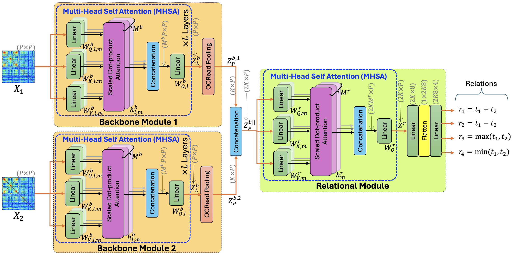

# Relational Connectivity Transformer

This is the code repository for our [paper](#cite) titled "RCT: Relational Connectivity Transformer for Enhanced Prediction of Absolute and Residual Intelligence" [[PDF]](https://github.com/marafathussain/marafathussain.github.io/blob/source/assets/pdf/prime2024.pdf) that introduces the Relational Connectivity Transformer (RCT), a novel Graph-Transformer model designed for predicting absolute and residual full-scale intelligence quotient (FSIQ), performance IQ (PIQ), and verbal IQ (VIQ) scores from resting-state functional magnetic resonance imaging (rs-fMRI) data.



## Acknowledgement

I adopted this repository from Xuan Kan's GitHub [Repo](https://github.com/Wayfear/BrainNetworkTransformer), and then I modified, written, and rewritten different part of this project codes as per my requirement.

## Dataset

Download the ABIDE dataset from [here](https://drive.google.com/file/d/14UGsikYH_SQ-d_GvY2Um2oEHw3WNxDY3/view?usp=sharing).

## Preprocessing the Dataset and Generating Datalist and Associated Labels

Run the  ```data_fetch_process.ipynb``` notebook step-by-step to generate the datalist with required labels. You need to modify the directory paths.

## Usage

1. Set the ```path``` in the file ```source/conf/dataset/ABIDE.yaml``` to the path of your dataset.

2. Run the following command to train a model:

```
python -m source --multirun model=rbnt score=fiq
```

- **model**: set either of ```rbnt```, ```rbnt2```, ```rbnt3```, or ```rbnt4```, which correspond to architecture 1, 2, 3, and 4, respectively, used in our ablation study. We found optimal architecture being 3 (i.e., ```rbnt3```), and our reported results correspond to ```rbnt3```.

- **score**: set either of ```piq``` (for PIQ), ```viq``` (for VIQ), ```fiq``` (for FSIQ), ```piq_r``` (for rPIQ), ```viq_r``` (for rVIQ), or ```fiq_r``` (for rFSIQ). 


## Installation

```
conda create --name bnt python=3.9
conda install pytorch torchvision torchaudio cudatoolkit=11.3 -c pytorch
conda install -c conda-forge wandb
pip install hydra-core --upgrade
conda install -c conda-forge scikit-learn
conda install -c conda-forge pandas
```

## Dependencies

  - python=3.9
  - cudatoolkit=11.3
  - torchvision=0.13.1
  - pytorch=1.12.1
  - torchaudio=0.12.1
  - wandb=0.13.1
  - scikit-learn=1.1.1
  - pandas=1.4.3
  - hydra-core=1.2.0


<a name="cite"></a>

## Cite

Please cite our paper if you find this code useful for your work:
```
@inproceedings{
  hussain2024rct,
  title={RCT: Relational Connectivity Transformer for Enhanced Prediction of Absolute and Residual Intelligence},
  author={Mohammad Arafat Hussain and Ellen Grant and Yangming Ou},
  booktitle={6th International Workshop of Predictive Intelligence in Medicine (PRIME)},
  year={2024},
}
```
